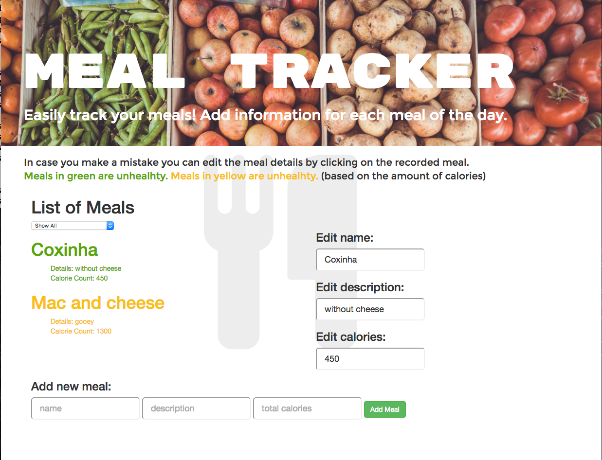

# :icecream::hamburger::spaghetti:_Meal Tracker_:pineapple::green_apple::corn:

##### _8/11/2016_

#### By _**Meaghan Jones**_

This app is a Meal Tracker made for the Epicodus JavaScript course (Week 2 Code Review | Angular JS).

The app allows a user to enter in a food item, a description and the amount of calories. The user can also edit this information after it has been inputted. Foods that are unhealthy (over 500 calories) are shown in yellow, while those that are healthy (under 500 calories) are shown in green. The user can also filter the inputted meals in order to see all meals, only healthy meals, or only unhealthy meals.

## Technologies Used
* Angularjs
* JavaScript
* npm
* bower

#### Installation
Install the project files by following the link below and cloning this repository:
* Clone the repository from github
```
$ git clone https://github.com/meaghanjones/calorie-count.git
```
* Then install npm and bower
```
$ npm install; bower install
```
* Open your browser. Run gulp build and serve and the application will launch in the open browser
```
$ gulp build; gulp serve
```




#### License

MIT License
Copyright (c) 2016 **Meaghan Jones**
